# Bilibili网页分析

[toc]

# 需要获取的信息

**视频信息**
1. 视频名称         videoName
2. 视频BV号         videoBVID
3. 视频url          videoUrl
4. 视频播放量       videoViews
5. 视频弹幕总数     videoDanmaku
6. 视频发布时间     videoReleaseTime
7. 视频上榜期数     videoBoardID
8. 视频点赞量       videoLikes
9. 视频投币量       videoCoins
10. 视频收藏量      videoFavourites
11. 历史排名        videoHistoryRank
12. 视频转发量      videoShares
13. 视频评论量      videoComments
14. 视频热评        videoRecommendReason
15. 视频第一个标签  videoTag


**up主信息**(user info)
1. up主名称         userName
2. up主ID           userID
3. up主粉丝数       userFollowers
4. up主个人网页url  userMainPageUrl

**排行榜信息**
1. 期数             BoardID
2. 排行榜url        BoardUrl

# 成功方法

经过尝试，通过先获取页面的json数据，可以看到相应的信息。

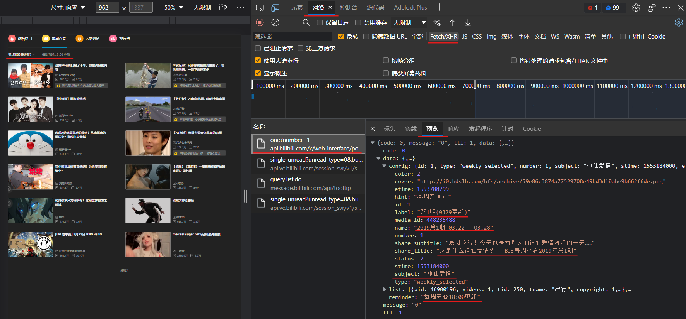

## 从排行榜页获取信息

请求的url也不再是我们在浏览器中输入的，需要从浏览器的开发人员工具中获取

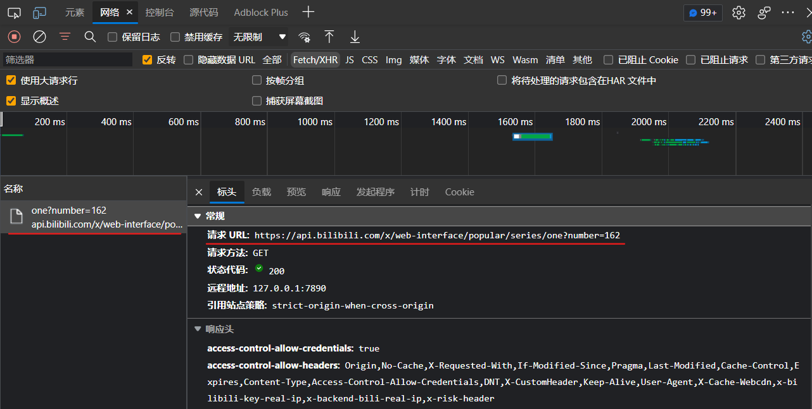


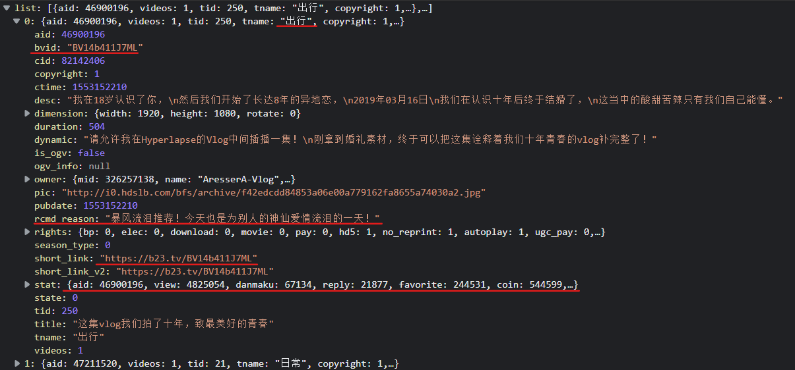

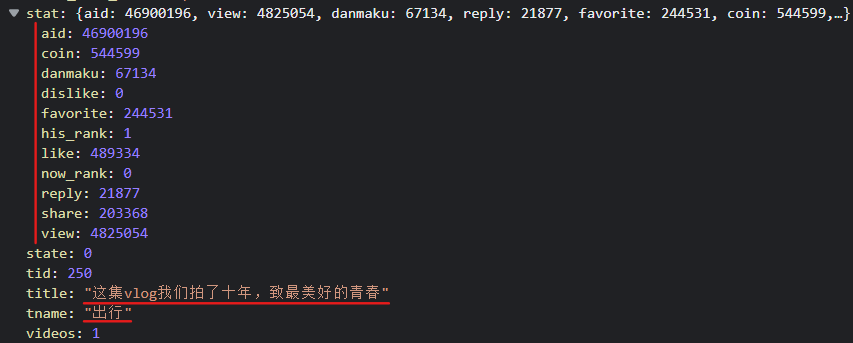


# 失败方法

经过尝试，这个方法无法成功获取到排行榜信息。

虽然在edge的开发人员工具中可以看到需要提取的信息，但是使用requests库，即使添加了UserAgent请求标头，仍然获取不到响应的信息。

可能是由于B站有相应的反爬措施。

## 从排行榜页获取排行榜期数

[每周必看排行榜第一期](https://www.bilibili.com/v/popular/weekly?num=1)

修改num后面的数字即可跳转到其他期。不填问号后面的默认最新一期。

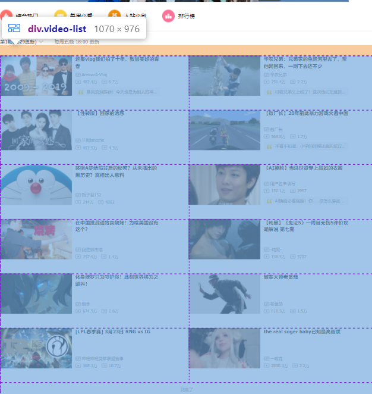

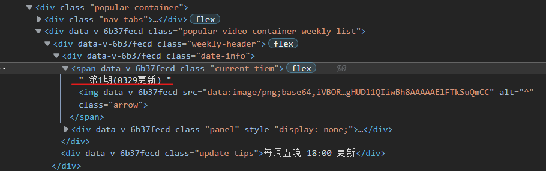

```html
<div data-v-6b37fecd="" class="weekly-header">
    <div data-v-6b37fecd="" class="date-info">
        <span data-v-6b37fecd="" class="current-tiem">
        第1期(0329更新)
        </span>
    </div> 
    <div data-v-6b37fecd="" class="update-tips">每周五晚 18:00 更新</div>
</div>
```

## 从排行榜页获取视频信息


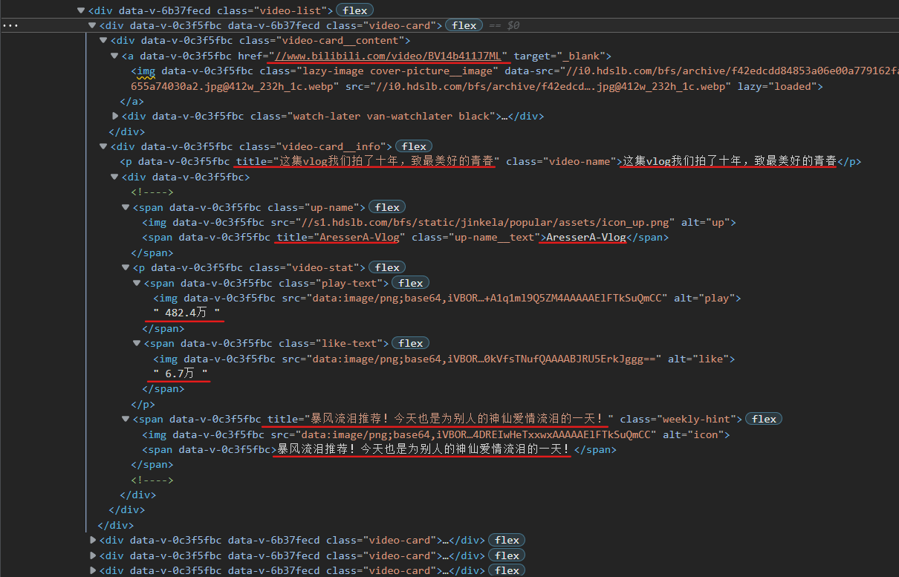

```html
<div data-v-0c3f5fbc="" data-v-6b37fecd="" class="video-card">
  <div data-v-0c3f5fbc="" class="video-card__content">
    <a data-v-0c3f5fbc="" href="//www.bilibili.com/video/BV14b411J7ML" target="_blank">
      
    </a> 
    <div data-v-0c3f5fbc="" class="watch-later van-watchlater black">
      <span class="wl-tips" style="display: none;"></span>
    </div>
  </div> 
  <div data-v-0c3f5fbc="" class="video-card__info">
    <p data-v-0c3f5fbc="" title="这集vlog我们拍了十年，致最美好的青春" class="video-name">这集vlog我们拍了十年，致最美好的青春</p> 
    <div data-v-0c3f5fbc="">
      <!----> 
      <span data-v-0c3f5fbc="" class="up-name">
         
        <span data-v-0c3f5fbc="" title="AresserA-Vlog" class="up-name__text">AresserA-Vlog</span>
      </span> 
      <p data-v-0c3f5fbc="" class="video-stat">
        <span data-v-0c3f5fbc="" class="play-text">
          
          482.4万
        </span> 
        <span data-v-0c3f5fbc="" class="like-text">
          
          6.7万
        </span>
      </p> 
      <span data-v-0c3f5fbc="" title="暴风流泪推荐！今天也是为别人的神仙爱情流泪的一天！" class="weekly-hint">
         
        <span data-v-0c3f5fbc="">暴风流泪推荐！今天也是为别人的神仙爱情流泪的一天！</span>
      </span> 
      <!---->
    </div>
  </div>
</div>
```

## 从视频详情页获取视频信息


```html
<div id="viewbox_report" class="video-info report-wrap-module report-scroll-module">
    <h1 id="video-title" title="这集vlog我们拍了十年，致最美好的青春" class="video-title">
        <!---->
        <span class="tit">这集vlog我们拍了十年，致最美好的青春</span>
    </h1>
    <div class="video-data">
        <span title="总播放数4824353" class="view">482.4万播放&nbsp;·&nbsp;</span>
        <span title="历史累计弹幕数67131" class="dm">总弹幕数6.7万</span>
        <span>2019-03-21 15:10:10</span>
        <span title="本日日排行数据过期后，再纳入本稿件的历史排行数据进行对比得出" class="rank">&nbsp;&nbsp;全站排行榜最高第1名</span>
    </div>
</div>
```

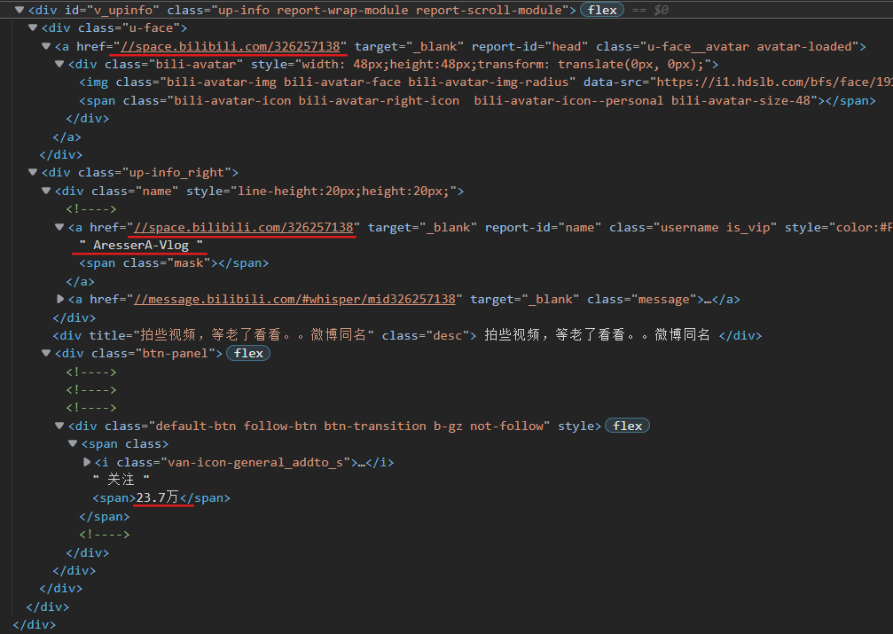

```html
<div id="v_upinfo" class="up-info report-wrap-module report-scroll-module">
    <div class="u-face">
        <a href="//space.bilibili.com/326257138" target="_blank" report-id="head" class="u-face__avatar avatar-loaded">
            <div class="bili-avatar" style="width: 48px;height:48px;transform: translate(0px, 0px);">
                
                <span class="bili-avatar-icon bili-avatar-right-icon  bili-avatar-icon--personal bili-avatar-size-48"></span>
            </div>
        </a>
    </div>
    <div class="up-info_right">
        <div class="name" style="line-height:20px;height:20px;">
        <!---->
        <a href="//space.bilibili.com/326257138" target="_blank" report-id="name" class="username is_vip" style="color:#FB7299;">
            AresserA-Vlog
            <span class="mask"></span>
        </a>
        </div>
        <div title="拍些视频，等老了看看。。微博同名" class="desc">
        拍些视频，等老了看看。。微博同名
        </div>
        <div class="btn-panel">
            <!----><!----><!---->
            <div class="default-btn follow-btn btn-transition b-gz not-follow" style="">
                <span class="">
                    <i class="van-icon-general_addto_s"></i>
                    关注
                    <span>23.7万</span>
                </span>
                <!---->
            </div>
        </div>
    </div>
</div>
```

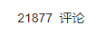

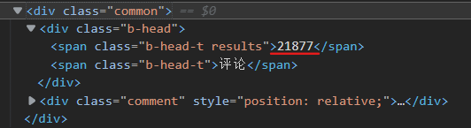

```html
<div class="common">
    <div class="b-head">
        <span class="b-head-t results">21877</span>
        <span class="b-head-t">评论</span>
    </div>
</div>
```

## 从视频详情页获取视频长度

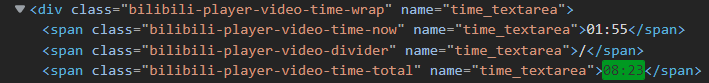

```html
<div class="bilibili-player-video-time-wrap" name="time_textarea">
    <span class="bilibili-player-video-time-now" name="time_textarea">01:55</span>
    <span class="bilibili-player-video-divider" name="time_textarea">/</span>
    <span class="bilibili-player-video-time-total" name="time_textarea">08:23</span>
</div>
```

## 从视频详情页获取点赞、投币、收藏、转发量

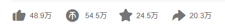

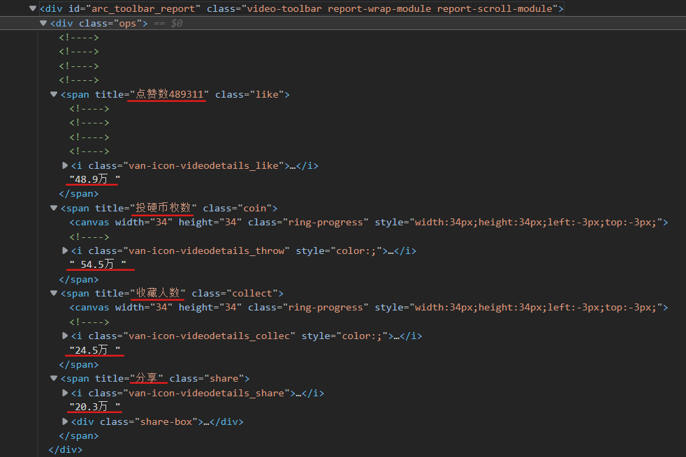

```html
<div id="arc_toolbar_report" class="video-toolbar report-wrap-module report-scroll-module">
    <div class="ops">
        <!----><!----><!----><!---->
        <span title="点赞数489311" class="like">
            <!----><!----><!----><!---->
            <i class="van-icon-videodetails_like"></i>
            48.9万
        </span>
        <span title="投硬币枚数" class="coin">
            <canvas width="34" height="34" class="ring-progress" style="width:34px;height:34px;left:-3px;top:-3px;"></canvas>
            <!---->
            <i class="van-icon-videodetails_throw" style="color:;"></i>
            54.5万
        </span>
        <span title="收藏人数" class="collect">
            <canvas width="34" height="34" class="ring-progress" style="width:34px;height:34px;left:-3px;top:-3px;"></canvas>
            <!---->
            <i class="van-icon-videodetails_collec" style="color:;"></i>
            24.5万
        </span>
        <span title="分享" class="share"><i class="van-icon-videodetails_share"></i>
        20.3万
        </span>
    </div>
</div>
```


## 从视频详情页获取视频标签

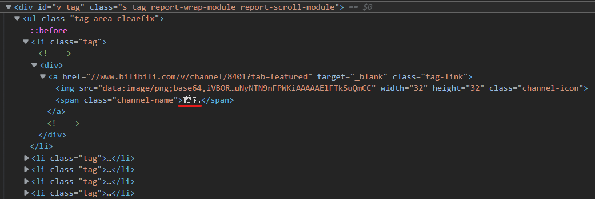

```html
<li class="tag">
    <!---->
    <div>
        <a href="//www.bilibili.com/v/channel/8401?tab=featured" target="_blank" class="tag-link">
            
            <span class="channel-name">婚礼</span>
        </a>
        <!---->
    </div>
</li>
```