# 从零开始手写决策树(Decision Tree from Scratch)

1950083 自动化 刘智宇

[toc]

## Portals

[项目地址 Github](https://github.com/leizhenyu-lzy/BigHomework/tree/main/DecisionTree)

[项目使用视频介绍 B站](https://www.bilibili.com/video/BV1yY4y1B7zr)

# 项目文件夹结构说明

项目文件夹如图所示：
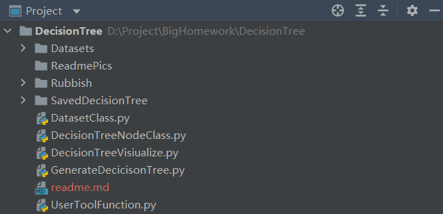

|序号|文件/文件夹|说明|
|----|----------|---|
| 1 | Datasets|存放数据集的文件夹（包括四个西瓜数据集和一个iris数据集）|
| 2 | ReadmePics|存放readme.md所使用的图片|
| 3 | Rubbish|对本项目没有用到的文件，以后迭代时可能会使用到|
| 4 | SavedDecisionTree|保存的决策树图片以及混淆矩阵图片|
| 5 | DatasetClass.py|数据集类|
| 6 | DecisionTreeNodeClass.py|决策树节点类|
| 7 | DecisionTreeVisualize.py|决策树可视化函数|
| 8 | GenerateDecisionTree.py|生成决策树函数|
| 9 | readme.md|本.md文件|
|10 | UserToolFunction.py|存放一些通用函数和常量定义|

# 项目实现内容

本项目主要参照《西瓜书》第4章决策树内容进行编写。并仅仅使用一些基本的库将第4章内容基本全部实现，包括以下几点：
1. 基本决策树树建立流程
2. 划分选择算法
   1. 信息增益：EntropyGain
   2. 增益率：GainRatio
   3. 基尼系数：GiniValue
3. 连续值处理（目前仅支持信息增益）

除此之外，为了更好的展示决策树形态及其效果，额外增加可视化：
1. 决策树结构可视化，如下图所示
   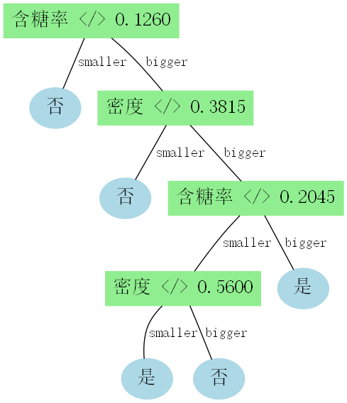
2. 混淆矩阵可视化
   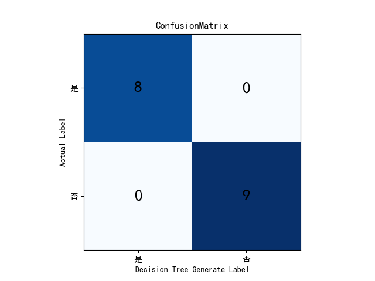

我自认为的亮点：
1. **可以适配各种大小的数据集**（不同的样本数，特征数）
2. **可以适配不同数据类型的特征（整型、浮点型、字符串等等）**（给数据集即可，不需要手动设定）
3. 可以适配连续和离散特征（需要指明连续离散特征）
4. 可视化支持中文

# 算法原理理解

算法原理理解我主要参考西瓜书进行学习，下面进行简述。

## 基本流程

决策树（decision tree）是一类常见的机器学习方法，基于树结构进行决策，和人的处理机制类似（一系列的子决策）。决策树学习目的是为了产生一棵泛化能力强的决策树，基本原则遵循“分而治之”。

生成决策树的过程就是一个递归的过程：
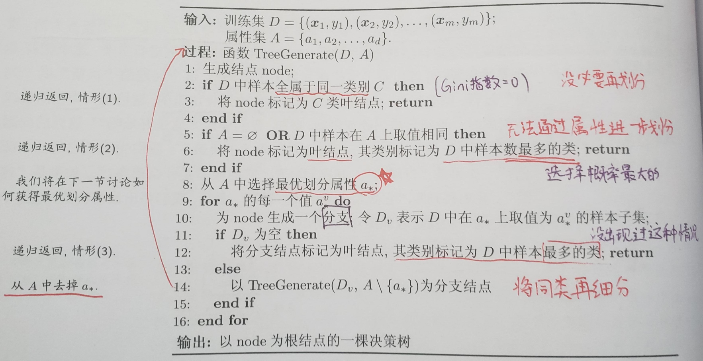

## 划分选择

### 信息增益

信息熵用于度量样本集合纯度。

信息熵的定义：
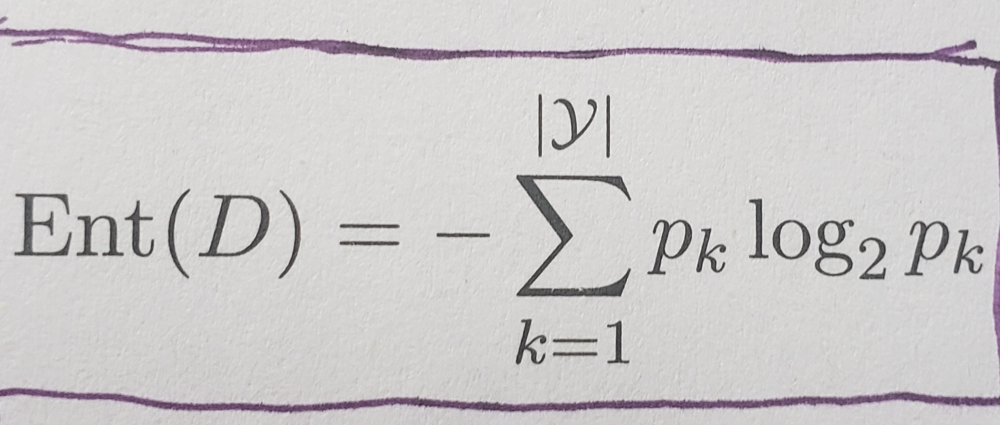
k代表label可能值的序号。信息熵的值越小，纯度越高。


信息增益的定义：
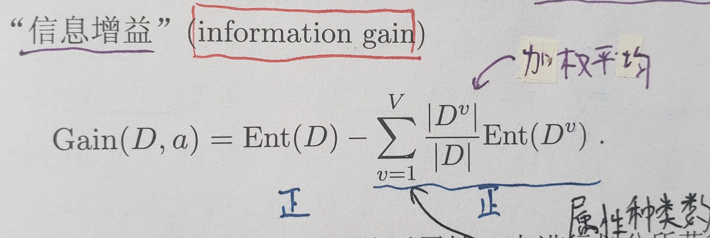
信息增益越大越好。这一点其实很显然，Ent(D)大说明原来乱，而减数小说明划分后各个子集不乱，而这样差值大，因此信息增益要选择最大的。

ID3决策树就是适用信息增益为准则划分属性。

### 增益率

而信息增益率则是对于信息增益的一次改进：为了减少信息赠与准则对于可取值数目较多的属性的偏好，使用固有值IV（intrinsic value）对信息增益进行优化。

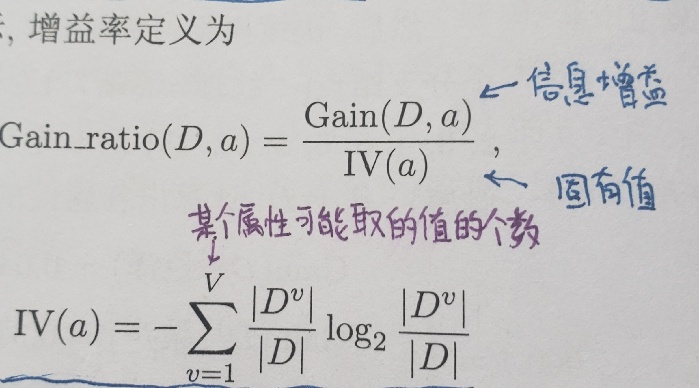

很显然增益率也应该选择较大的。

### 基尼指数
CART决策树基于基尼指数（Gini Index）选择划分特征。在我看来，基尼系数和之前的信息增益类似。

基尼值的定义：
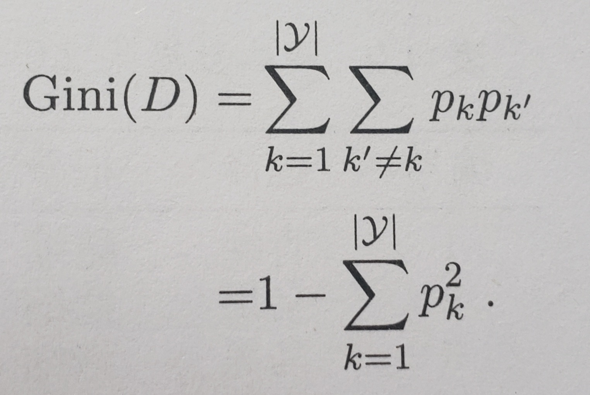
基尼指数的定义：
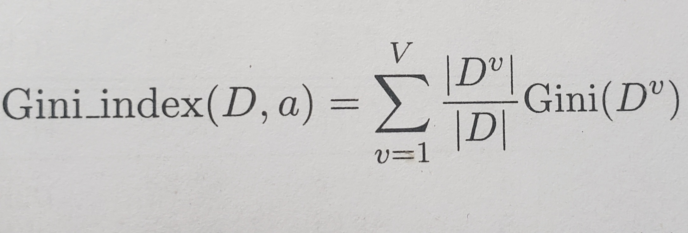

值得注意的是，基尼指数与信息增益的减数部分类似，所以应选择使基尼指数较小的划分特征。


## 连续值处理

之前讨论的都是离散特征，对于连续特征稍有不同，需要使用离散化技术。例如C4.5使用的二分法（bi-partition）。

二分法的思想其实很简单，就是先将连续特征的特征值进行排序，{$a_1,a_2,a_3,……,a_n$}。将排序值所有相邻两个值的平均值作为候选划分点，共n-1个。通过划分点将样本划分发为两个子集，然后分别计算按照该划分点进行拆分的信息增益。使得信息增益最大的即为当前的最优划分点。换句话说，就是将连续特征变为一个和划分值有关的二值离散特征。

由于书上仅提到了对于信息增益的连续值处理，对于基尼指数和信息增益率的实现暂且未知，我还未去了解故本项目仅实现了信息增益对于连续特征的处理。

==值得注意的是==：和离散特征不同的是，如果当前节点划分特征为连续特征，该特征还可以作为决策树子节点的划分属性。


# 代码实现及其说明

代码主要分为5个.py文件， 下面进行一一说明。（代码实现内容过多，就不在此进行展示，具体可在github查看）

## DatasetClass.py
文件结构如下：
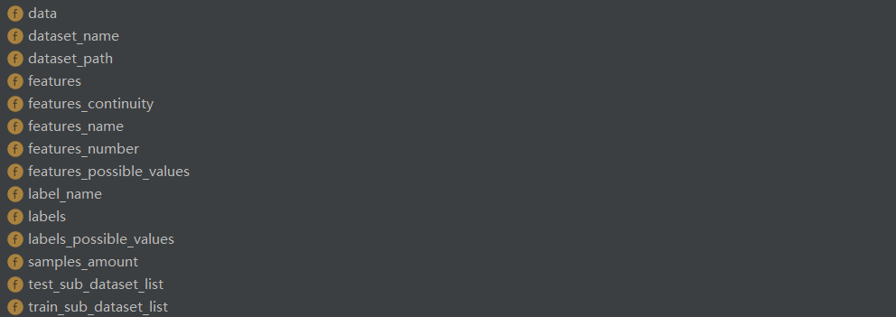
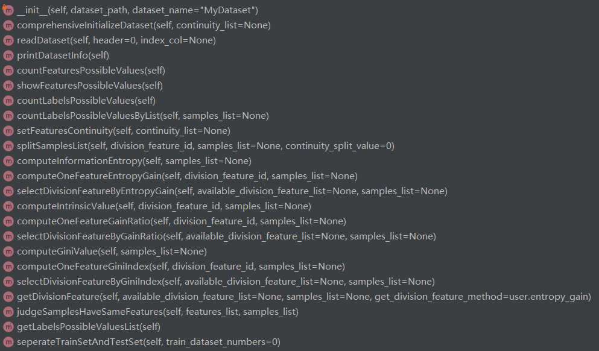

该部分代码部分较多，挑几个比较重要的讲一下。

### 成员变量
```python
self.dataset_name = dataset_name  # 数据集名称
self.dataset_path = dataset_path  # 数据集文件路径
self.samples_amount = 0  # 数据集样本个数

self.data = []  # 数据集内容

self.features_number = 0  # 特征索引个数
self.features_name = []  # 全部特征名称，用于后续决策树划分
self.features = []  # 数据集的全部样本特征数据
self.features_continuity = []  # 连续特征标记（1表示连续，0表示离散）

self.labels = []
self.label_name = ""  # 标签索引名称

self.features_possible_values = []  # 各个特征的全部可能的特征值，列表元素为字典，字典内为feature的值及对应个数
self.labels_possible_values = {}  # 标签的可能值（字典,labels可能值和对应数量）

self.train_sub_dataset_list = []
self.test_sub_dataset_list = []
```

### 成员函数

有几个比较重要、常用的成员函数这里进行简介，具体实现还是请参考github代码
1. comprehensiveInitializeDataset : 通过读取数据集对当前数据集进行较为全面初始化
2. readDataset : 读取数据集，主要是利用pandas的read_csv函数，并添加一些额外功能
3. printDatasetInfo : 打印数据基本信息
4. countLabelsPossibleValuesByList : 
5. setFeaturesContinuity : 通过传入列表设置各个特征的连续性
6. **splitSamplesList** : 通过给定的特征对样本列表进行划分（对于连续和离散都适用）
7. selectDivisionFeatureByEntropyGain : 通过信息增益的方式选出最合适的划分特征
8. selectDivisionFeatureByGainRatio : 通过信息增益率的方式选出最合适的划分特征
9. selectDivisionFeatureByGiniIndex : 通过基尼系数的方式选出最合适的划分特征
10. getDivisionFeature : 将上述三个选择统一在一起作为对外的接口
11. judgeSamplesHaveSameFeatures : 判断给定的samples再给定的features十分完全相同（方便后续判断决策树是否跳出循环）
12. seperateTrainSetAndTestSet : 拆分数据集和训练集


## DecisionTreeNodeClass.py
文件结构如下：
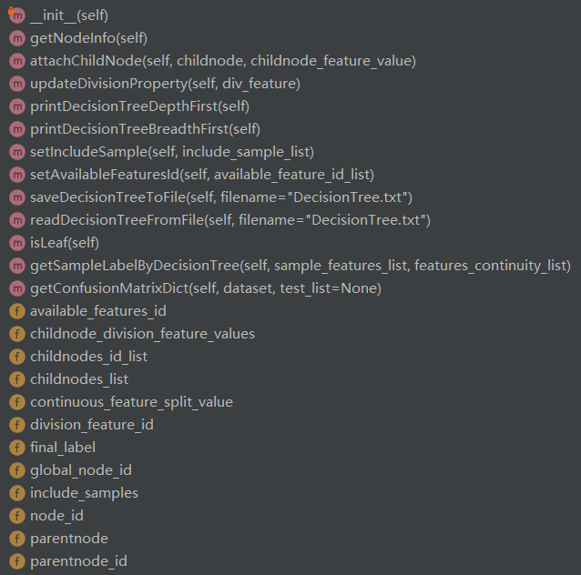

### 成员变量
```python
self.node_id = DecisionTreeNode.global_node_id  # 节点编号（单个数值）
DecisionTreeNode.global_node_id += 1  # 共享变量自增

self.parentnode = None  # 父节点（单个节点）
self.parentnode_id = None  # 父节点编号（单个数值）
self.childnodes_list = []  # 子节点列表（节点列表）
self.childnodes_id_list = []  # 子节点编号列表（数值列表）

self.division_feature_id = None  # 当前节点用于划分子节点的划分特征编号（单个数值）
self.childnode_division_feature_values = []  # 子节点对应划分特征的特征值（特征值列表）
# （对于连续值，二分法，存放相同的值，默认左节点为'smaller'，右节点为'bigger'）
self.continuous_feature_split_value = None  # 若当前的划分特征为连续值，用于记录最佳划分特征值

self.include_samples = []  # 当前节点包含的样本编号（数值列表）
self.available_features_id = []  # 可用的划分特征列表，从父节点的改成员变量删去父节点划分特征所得（数值列表）
self.final_label = None  # 对于叶节点，给出归到这里的样本的最终决策结果（标注的实际值）
```

除此以外，我还定义了一个类共享的变量：global_node_id，在每次创建新节点时，会进行自增，方便对节点进行编号和后续绘图。

```python
global_node_id = 0  # 类共享变量（在有新treenode创建时会自增）
```

### 成员函数
有几个比较重要、常用的成员函数这里进行简介，具体实现还是请参考github代码
1. getNodeInfo : 打印节点信息
2. attachChildNode : 将子节点添加到当前节点的子节点列表（进行链接）
3. printDecisionTreeDepthFirst : 深度优先在终端打印以当前节点为根节点的决策树基本信息
4. printDecisionTreeBreadthFirst : 广度优先在终端打印以当前节点为根节点的决策树基本信息
5. isLeaf : 判断当前节点是否为叶节点
6. getSampleLabelByDecisionTree : 获取决策树根据已知特征进行的label判断结果
7. getConfusionMatrixDict : 生成字典形式的混淆矩阵


## UserToolFunction.py
文件结构如下：
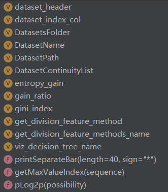

文件开头定义了一些数据集和决策树会使用到的一些变量。

后面实现了一些很简单的函数，我认为不适合放在其他位置，故放到了此处。

## GenerateDecisionTree.py
文件结构如下：


本文件较为简单，仅有一个生成决策树的函数（递归思想），该函数按照西瓜书图4.2的结构进行编写。

在该文件的__main__函数中，我将整个决策树生成即可视化进行串联。即==可以运行该main函数根据给定数据集训练出相应决策树==。（**注意，由于西瓜数据集过于简单，我并没有进行train、test的拆分，我另外添加了一个鸢尾花数据集（IRIS）进行了拆分。**）


## DecisionTreeVisualize.py
文件结构如下：
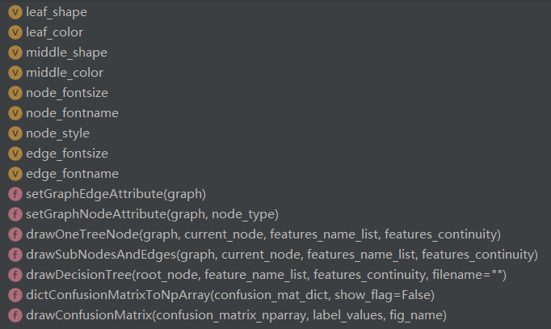

这一部分调用了Graphviz包进行决策树的可视化及保存以及matplotlib包进行混淆矩阵的绘制及保存。其中Graphviz包的使用介绍略微有些难找，故将其网址放在下方。

[Graphviz官方文档](https://graphviz.readthedocs.io/en/stable/examples.html)

我在文件最前面定义了一些常量，主要用于设置决策树绘制的颜色字体等，字体最好不要改动，否则可能会导致中文乱码。


# 项目使用说明

首先将自己的数据集放入Datasets文件夹中（也可以不放，将后面的DatasetPath进行相应修改即可）。

其次在UserToolFunction.py文件中，填入以下内容：
1. DatasetName、DatasetPath两个数据集基本信息
2. 对于有连续特征的数据集，还需额外显式指明DatasetContinuityList，用0和1分别表示每个特征的连续性（0为非连续，1为连续），DatasetContinuityList长度应等于特征的个数，且对应每一个特征。对于全为离散特征的数据集，写None即可
3. 对于想要拆分train和test还需另外传入一个TrainSamplesAmount指明希望拆分得到的训练集个数
4. 指明使用的选取最优划分特征的方法：get_division_feature_method（对于有连续特征的数据集目前只能选择entropy_gain）
5. 保存决策树结构图片和混淆矩阵图片的文件名（有默认值）

另外对于生产决策树过程，对GenerateDecisionTree.py中的main函数进行选取
1. 对于不想划分训练集和测试集：使用上方类似于西瓜数据集部分
2. 对于想要划分训练集和测试集：使用下方类似鸢尾花数据集部分

最后运行GenerateDecisionTree.py的main函数即可。


# 代码测试结果

## 西瓜数据集2.0

西瓜数据集2.0如图所示：（只有6个离散特征）
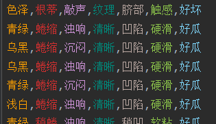

西瓜书上对于西瓜数据集2.0使用信息增益的方式进行最优特征选择所得到的决策树如下图：
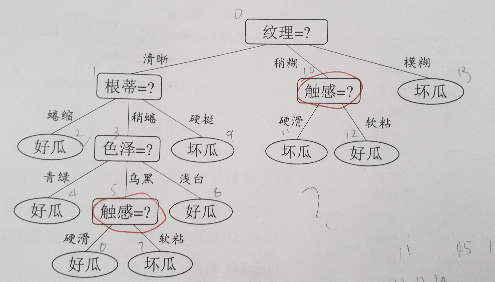

本项目生成的相应决策树如下图：
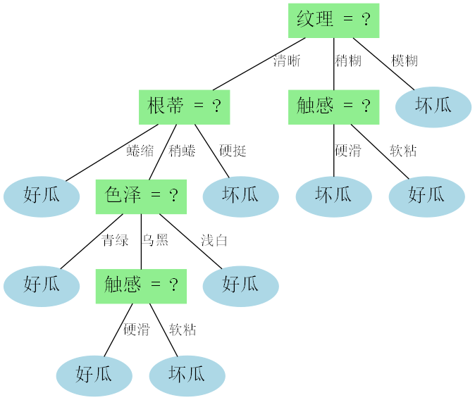
相应的混淆矩阵如下图：


可以看到两个决策树完全一致。

下面测试使用信息增益率作为选取最优划分准则的方法所生成的决策树：

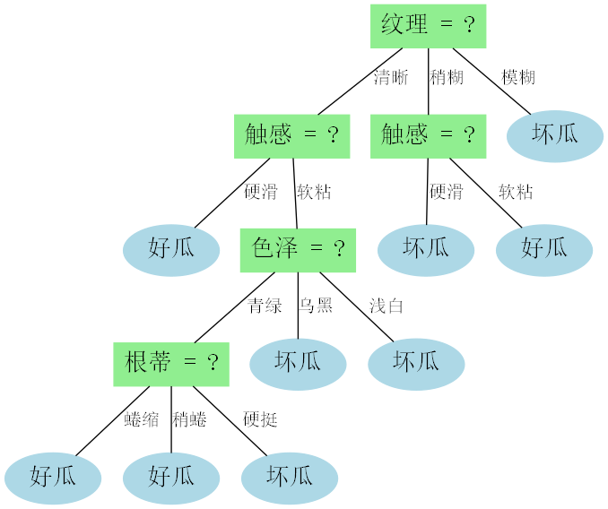

下面测试使用基尼系数作为选取最优划分准则的方法所生成的决策树：


## 西瓜数据集3.0

西瓜数据集3.0如图所示：（有2个连续特征和6个离散特征）
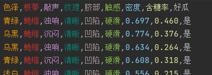

西瓜书上对于西瓜数据集3.0使用信息增益的方式进行最优特征选择所得到的决策树如下图：
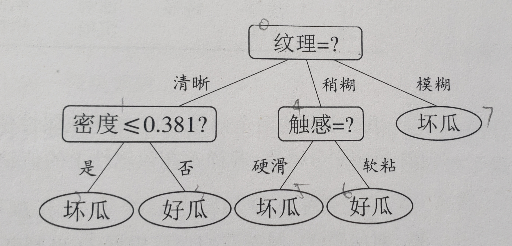

本项目生成的相应决策树如下图：
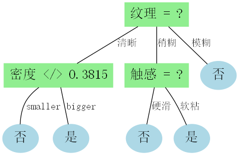
相应的混淆矩阵如下图：


可以看到两个决策树除了精确位数略有不同，结构等信息完全相同。

## 西瓜数据集3.0alpha

西瓜数据集3.0alpha如图所示：（只有2个连续特征）
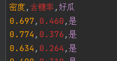

西瓜书上对于西瓜数据集3.0使用信息增益的方式进行最优特征选择所得到的决策树如下图：
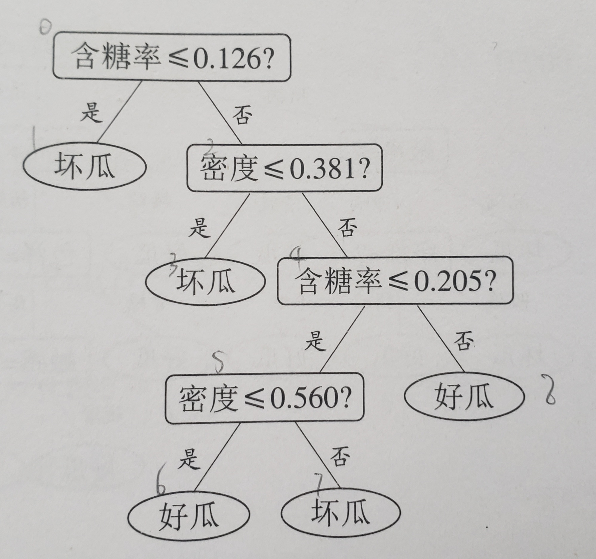

本项目生成的相应决策树如下图：

相应的混淆矩阵如下图：


可以看到两个决策树除了精确位数略有不同，结构等信息完全相同。

## 鸢尾花数据集

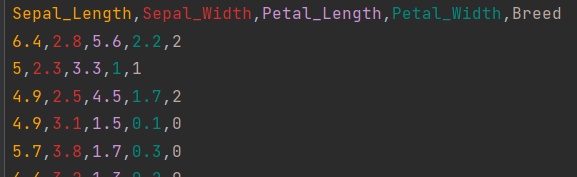

数据集由四个连续特征组成，使用留出法划分数据集（70个样本）和测试集（50个样本），生成的决策树如下所示（由于是随机选取的样本分给train和test所以每次结果未必相同）。

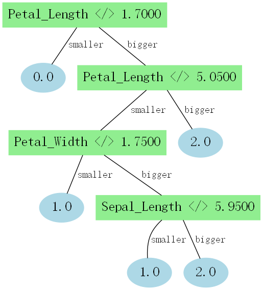

这里的0.0、1.0、2.0分别对应三种鸢尾花。

使用测试集计算混淆矩阵，分类结果还行：

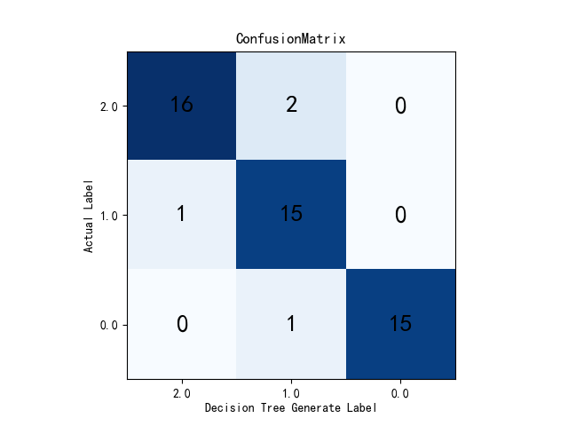


# 学习体会

决策树算法虽然看上去十分的浅显易懂，但是在实际进行代码实现时却没有想象中那么简单。许多时候以为自己理解某个部分了，但是在代码实现时发现“南辕北辙”，才意识到自己的问题，所以代码实现有时是很有必要的。此外，在写代码时常常由于思绪混乱导致遇到各种bug，好在最终都一一解决了，在调试代码的过程中也锻炼了我的耐心。

此外，本次决策树代码实现使用了面向对象思想（树节点类、数据集类），但在一开始却没有使用该思想。通过两个思想的对比也让我意识到了面向对象的优点，体会到了分装后在使用上的便捷。

本次决策树仅仅实现了西瓜书上的大部分代码以及一些自己感兴趣的可视化代码。书上还有一些决策树的基础功能有待实现：缺失值处理、剪枝（预剪枝、后剪枝）等等。今后有时间会将书上内容全部完成。此外，我还设想过将决策树以文件的形式进行存储，这样不必每次重新训练，仅需从保存的文件读取即可，但是该功能尚未实现。

当然，除了决策树，我还会在闲暇之余实现其他的机器学习算法，为今后的深入学习打下基础。


