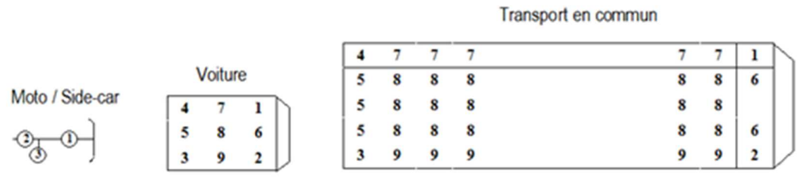

# 数据集特征分析

驾驶员出生年份 An_nais 和 事故发生年份 an 可以进行减法，算出驾驶员事故年龄
受伤严重程度 grav
驾驶员性别 sexe
最大限速 vma
路面情况 surf
路宽 larrout & 中央隔离带宽度 lartpc（可能后面这个没用）
邮政地址 adr估计没用
气候条件 atm肯定有用
交叉路口 int肯定有用
道路类别 catr肯定有用
交通制度 circ应该有用

|特征名称|说明|分析|
|----|----|----|
||||

特征说明

Num_Acc：事故编号

jour：事故日期

mois：事故月份

an：事故年份

hrmn：事故时间（在一天的百分比，可能需要进行转换*86400之类的）

lum：光照条件
	1. Full day 全天
	2. Twilight or dawn  日出日落
	3. Night without public lighting  晚上没有公共照明
	4. Night with public lighting not on  晚上公共照明没开
	5. Night with public lighting on  晚上公共照明开启

dep：行政区划编号
    2A上科西嘉
    2B南科西嘉

com：自治区编号，dep编号后面跟3个数字

agg：地点
    1. 聚集区
    2. 建成区

int：交叉路口
	1. 无交叉路口
	2. Intersection in X
	3. T-intersection
	4. Y intersection
	5. Intersection with more than 4 branches
	6. Roundabout  环道
	7. Place
	8. Level crossing  平行道
	9. 其他交叉路口

atm：气候条件
	-1. Not specified 未知
	1. Normal
	2. Light rain
	3. Heavy rain
	4. Snow. hail
	5. Fog. smoke
	6. Strong wind. storm
	7. Dazzling weather  强光
	8. Cloudy weather
	9. Other

col：碰撞类型
	-1. Not specified
	1. Two vehicles. frontal
	2. Two vehicles. from the rear
	3. Two vehicles. from the side
	4. Three vehicles and more. in a chain
	5. Three or more vehicles. multiple collisions
	6. Other collision 
	7. No collision

adr：邮政地址（估计没用）

lat：纬度

long：经度

catr：道路类别
	1. Highway
	2. National road
	3. Departmental road
	4. Communal roads
	5. Outside the public network
	6. Parking lot open to public traffic
	7. Urban metropolis roads
	9. other

voie：道路名称

V1：Numerical index of the road number (example: 2 bis, 3 ter etc.). 

V2：Alphanumeric road index letter.

circ：交通制度
	-1. Not specified
	1. One way
	2. Bidirectional
	3. A separate carriageway
	4. With variable assignment channels

nbv：车道总数

vosp：是否有专用车道
	-1. Not specified
	0. Not applicable
	1. Cycle path
	2. Cycle lane
	3. Reserved lane 专用车道

prof：事故坡度
	-1. Not specified
	1. Flat
	2. Slope
	3. hilltop
	4. Bottom of coast

pr：

pr1：

plan：道路设计布局
	-1. Not specified
	1. rectilinear part  直线部分
	2. In a curve to the left
	3. In a curve to the right
	4. In "S"

lartpc：中央隔离带宽度

larrout：路宽

surf：路面情况
	-1. Not specified
	1. Normal
	2. Wet
	3. Puddles
	4. Flooded
	5. Snowy
	6. Mud
	7. Icy
	8. Fat. oil
	9. Other

infra：发生地情况
	-1. Not specified
	1. None
	2. Underground. tunnel
	3. Bridge. flyover
	4. Exchanger or connection sling
	5. Railroad
	6. Crossroads
	7. Pedestrian zone
	8. Toll zone
	9. Site
	10. Others

situ：事故情况
	-1. Not specified
	0. None
	1. On the road
	2. On emergency lane
	3. On the shoulder
	4. On the sidewalk
	5. On a cycle path
	6. On other special track
	8. Others

vma：事故现场和事故发生时的最高限速

Num_Veh：(不知道有什么卵用)
	Identifier of the vehicle taken back for each of the users occupying this vehicle (including pedestrians who are attached to the vehicles which collided with them). Alphanumeric code. 

senc
	-1. Not specified
	0. Unknown
	1. PK or PR or increasing postal address number
	2. PK or PR or decreasing postal address number
	3. Lack of reference

catv：事故车辆类型
	00. Not determinable
	01. Bicycle
	02. Moped &lt;50cm3
	03. Cart (Quadricycle with bodywork motor) (formerly "cart or motor tricycle")
	04. Reference not used since 2006 (registered scooter)
	05. Reference unused since 2006 (motorcycle)
	06. Reference unused since 2006 (sidecar)
	07. VL only
	08. Reference unused since 2006 (VL + caravan)
	09. Reference not used since 2006 (light vehicles + trailer)
	10. VU only 1.5T &lt;= PTAC &lt;= 3.5T with or without trailer (formerly VU only 1.5T &lt;= PTAC &lt;= 3.5T)
	11. Reference not used since 2006 (VU (10) + caravan)
	12. Reference not used since 2006 (VU (10) + trailer)
	13. PL only 3.5T <PTCA <= 7,5T 
	14. PL only > 7.5T
	15. PL> 3,5T + trailer
	16. Road tractor only
	17. Road tractor + semi-trailer
	18. Reference not used since 2006 (public transport)
	19. Reference not used since 2006 (tram)
	20. Special gear
	21. Farm tractor
	30. Scooter <50 cm3
	31. Motorcycle> 50 cm3 and <= 125 cm3
	32. Scooter> 50 cm3 and <= 125 cm3
	33. Motorcycle> 125 cm3
	34. Scooter> 125 cm3
	35. Light quad <= 50 cm3 (Quadricycle without bodywork engine)
	36. Heavy quad> 50 cm3 (Quadricycle without bodywork engine)
	37. Bus
	38. Coach
	39. Train
	40. Tram
	41. 3WD <= 50 cm3
	42. 3WD> 50 cm3 <= 125 cm3
	43. 3WD> 125 cm3
	50. EDP with motor
	60. EDP without motor
	80. VAE
	99. Other vehicle 

obs：撞到的固定障碍物
	-1. Not specified
	0. Not applicable
	1. Parked vehicle
	2. Tree
	3. Metal slide
	4. Concrete slide
	5. Other slide
	6. Building, wall, bridge pier
	7. Vertical signage support or emergency call station
	8. Post
	9. Street furniture
	10. Parapet
	11. Island, refuge, upper terminal
	12. Sidewalk edge
	13. Ditch, embankment, rock face
	14. Other fixed obstacle on the road
	15. Other fixed obstacle on sidewalk or shoulder
	16. Clearance of the roadway without obstacle
	17. Nozzle. aqueduct head

obsm：撞到的移动障碍物
	-1. Not specified
	1. None
	2. Pedestrian
	3. Vehicle
	4. Rail vehicle
	5. Domestic animal
	6. Wild animal
	7. Other 

choc：撞击位置
	-1. Not specified
	0. None
	1. Before
	2. Right front
	3. Front left
	4. Rear
	5. Right back
	6. Left rear
	7. Right side
	8. Left side
	9. Multiple shocks (rolls) 

manv：事故发生前的主要动作
	-1. Not specified
	0. Unknown
	1. Without change of direction
	2. Same direction, same row
	3. Between 2 lines
	4. In reverse
	5. In the wrong way
	6. Crossing the central reservation
	7. In the bus lane, in the same direction
	8. In the bus lane, in the opposite direction
	9. By inserting
	10. By making a U-turn on the road
	Changing lane
	11. Left
	12. Right
	Deported
	13. Left
	14. Right
	Turning
	15. Left
	16. Right
	Exceeding
	17. Left
	18. Right
	Various
	19. Crossing the road
	20. Parking maneuver
	21. Avoidance maneuver
	22. Door opening
	23. Stopped (except parking)
	24. Parked (with occupants
	25. Traveling on sidewalk
	26. Other maneuvers 

motor：引擎类型
	-1. Not specified
	0. Unknown
	1. Hydrocarbons
	2. Electric hybrid
	3. Electric
	4. Hydrogen
	5. Human
	6. Other 

occutc：公共交通乘员人数

id_vehicule：(不知道有什么卵用)
	Unique identifier of the vehicle used for each user occupying this vehicle (including
pedestrians who are attached to the vehicles which collided with them). Numerical code. 

Num_Veh：(不知道有什么卵用)
	Identifier of the vehicle taken back for each of the users occupying this vehicle (including pedestrians who are attached to the vehicles which collided with them). Alphanumeric code. 

place：
    Used to locate the space occupied in the vehicle by the user at the time of the accident
Check on this link for the pattern : https://ibb.co/NsTxbXP

catu：受伤人类别
	1. Driver
	2. Passenger
	3. Pedestrian 

grav：受伤严重程度
	1. Unharmed
	2. Killed
	3. Injured hospitalized
	4. Slightly injured 

sexe：驾驶员性别
	1. Male
	2. Female

An_nais：驾驶员出生年
    Year of birth of the driver（可以用于反映年龄）

trajet：发生事故的驾驶目的
	-1. Not specified
	0. Not specified
	1. Home. work
	2. Home. school
	3. Shopping. shopping
	4. Professional use
	5. Walk. leisure
	9. Other  

应该是三个secu说明用了哪三个安全设备（最多三个）
secu1：安全护具1
	-1. Not specified
	0. No equipment
	1. Belt
	2. Helmet
	3. Children's device
	4. reflective vest
	5. Airbag (2WD / 3WD)
	6. Gloves (2WD / 3WD)
	7. Gloves + Airbag (2WD / 3WD)
	8. Not determinable
	9. Other

secu2：安全护具2
	-1. Not specified
	0. No equipment
	1. Belt
	2. Helmet
	3. Children's device
	4. reflective vest
	5. Airbag (2WD / 3WD)
	6. Gloves (2WD / 3WD)
	7. Gloves + Airbag (2WD / 3WD)
	8. Not determinable
	9. Other

secu3：：安全护具3
	-1. Not specified
	0. No equipment
	1. Belt
	2. Helmet
	3. Children's device
	4. reflective vest
	5. Airbag (2WD / 3WD)
	6. Gloves (2WD / 3WD)
	7. Gloves + Airbag (2WD / 3WD)
	8. Not determinable
	9. Other

locp
    行人位置 :
	-1. 未指定
	0. 不适用
    在路面pavement上 :
	1. 距人行横道 + 50 m
	2. 距人行横道 不到 50 m
    在人行横道上:
	3. 没有交通信号灯
	4. 有交通信号灯
    多种情况 :
	5. 在人行道上
	6. 路肩上
	7. 在避难所或 BAU
	8. On counter aisle
	9. Unknown

actp：行人行为
	-1. Not specified
    Moving  
	0. Not specified or not applicable
	1. Direction of colliding vehicle
	2. Opposite direction of the vehicle
    Various
	3. Crossing
	4. Masked
	5. Playing. running
	6. With animal
	9. Other
	A. Get on / off the vehicle
	B. Unknown 

etatp：行人是否单独一人
	-1. Not specified 不知道
	1. Alone 单独
	2. Accompanied 有人陪同
	3. In a group 一堆人
