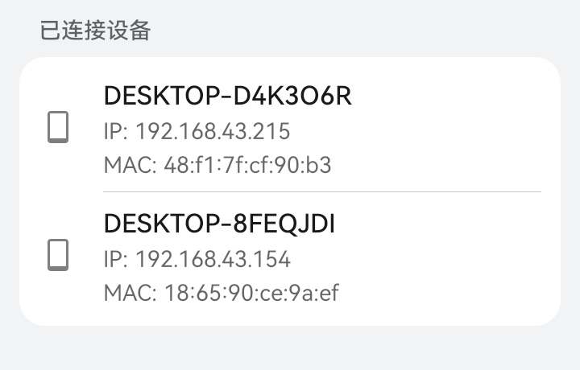
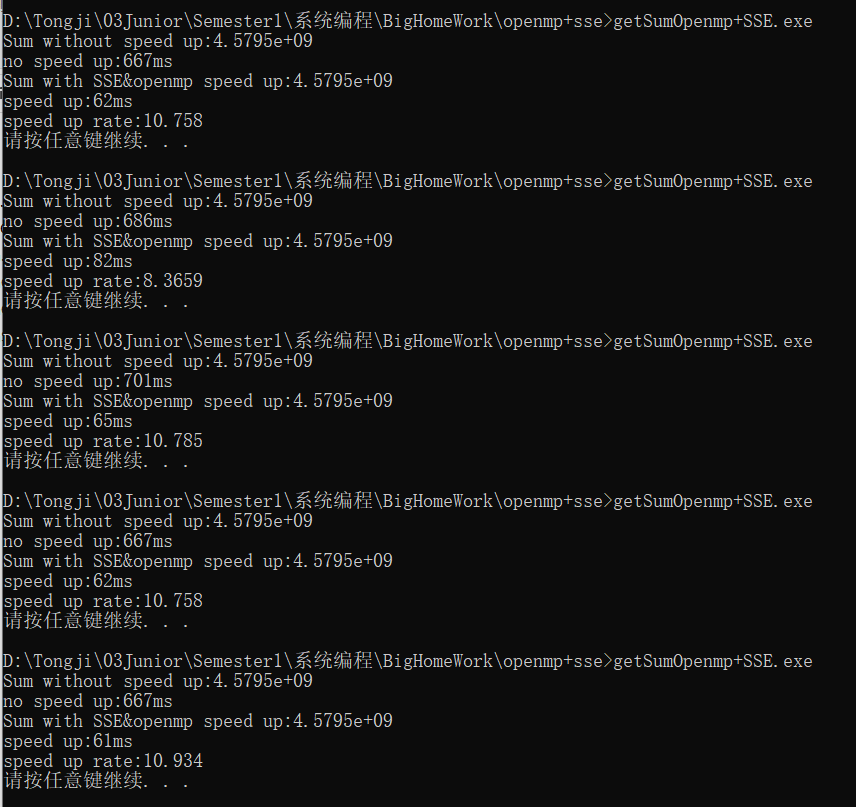
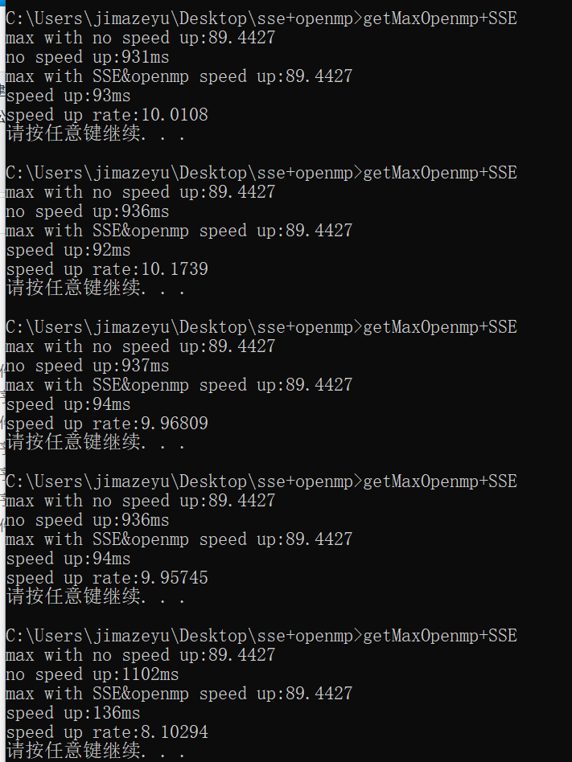
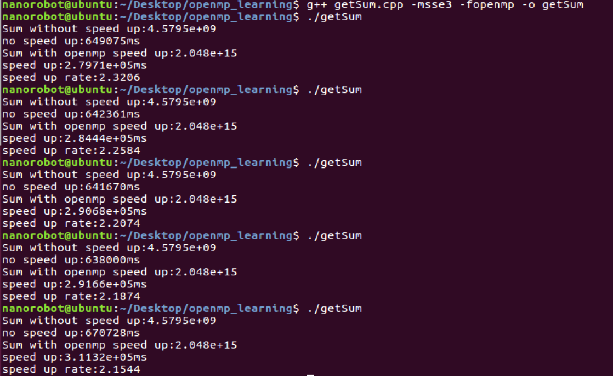
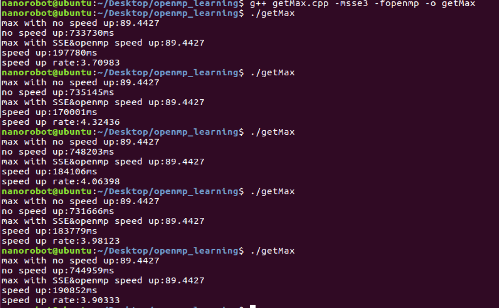
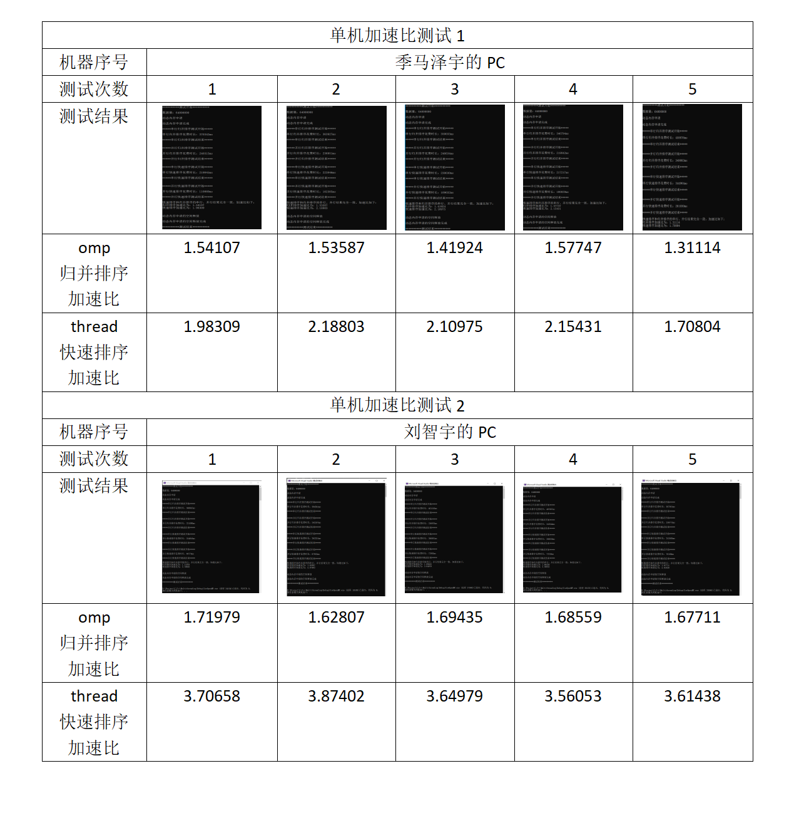

# 多机并行加速大作业报告

## 人员说明

**指导老师：王晓年**

**1950083---刘智宇**
1. OpenMP归并排序
2. Thread快速排序
3. Socket通信
4. 实验报告撰写

**1950089---季马泽宇**
1. OpenMP+SSE求最大值（Win+Linux）
2. OpenMP+SSE求和（Win+Linux）
3. Socket通信（Win+Linux）

<br>

## 测试环境

### Windows

**刘智宇的WindowsPC**

<div  align="center">    

</div>

**季马泽宇的WindowsPC**

<div  align="center">    

</div>

### Linux

**季马泽宇的LinuxPC**

<div  align="center">    

</div>

### 网络环境

<div  align="center">    

</div>

本次实验使用手机热点进行测试。一方面简化网络连接问题，另一方面可以随时查看两台设备的连接情况，十分便捷。

## 技术简介

### Socket

**套接字**（SOCKET）是通信的基石，是支持TCP/IP协议的路通信的基本操作单元。可以将套接字看作不同主机间的进程进行双间通信的端点，它构成了单个主机内及整个网络间的编程界面。套接字存在于通信域中，通信域是为了处理一般的线程通过套接字通信而引进的一种抽象概念。

我们希望使用Socket，将多台计算机的计算能力充分进行利用（集群的概念），进一步提升并行计算的速度。

### OpenMP

OpenMP是由OpenMP Architecture Review Board牵头提出的，并已被广泛接受，用于共享内存并行系统的多处理器程序设计的一套指导性编译处理方案(Compiler Directive)。**OpenMP提供**的这种对于**并行描述的高层抽象降低了并行编程的难度和复杂度**，这样**程序员可以把更多的精力投入到并行算法本身**，而非其具体实现细节。

在使用OpenMP进行开发的时候，我们也充分体验到了其带来的便捷性。**通过OpenMP编写并行归并排序**的时候十分方便。

### Thread

C++11中加入了<thread>头文件，**此头文件主要声明了std::thread线程类**。C++11的标准类std::thread对线程进行了封装。std::thread代表了一个线程对象。应用C++11中的std::thread便于多线程程序的移植。

在本次实验中，我们也**使用了thread头文件实现了多线程快速排序**。

### SSE

SSE是 “因特网数据流单指令序列扩展 ( Internet Streaming SIMD Extensions)的缩写。SSE除保持原有的MMX指令外，又新增了70条指令，**在加快浮点运算的同时，改善了内存的使用效率，使内存速度更快**。SSE由一组队结构的扩展组成，用以提高先进的媒体和通信应用程序的性能。该扩展(包括新的寄存器、新的数据类型和新的指令)与单指令多数据(SIMD)技术相结合，有利于加速应用程序的运行。这个扩展与MMX技术相结合，将显著地提高多媒体应用程序的效率。

## 求和&求最大值

### 多线程单机求和&求最大值

求取最大值和求和过程中，使用SSE指令进行加速，每次将四个float数字放入一条指令中，在四核计算机中理论加速比为4倍，实测不到三倍。接着使用循环展开进行优化，每次循环使用四个_m128类型存取数字，一次循环中执行十六个数字的求和（取最大值）。

由于使用gcc编译器不支持对log函数的sse加速，所以使用两次log函数模拟获取数据的过程。

另外，考虑到求和以及求最大值在单机已经足够迅速，故没有使用socket进行多机并行加速。

另外由于要在linux系统进行测试，故没有使用**QueryPerformanceCounter**进行计时，而是使用clock()函数。

### 求和求最大值函数说明

和作业要求相同

```cpp
float sum(const float data[],const int len); 
float max((const float data[],const int len);
float sumSpeedUp(const float data[],const int len);
float maxSpeedUp((const float data[],const int len);
```

### 求和与求最大值单机测试结果

#### Windows

**PC1的求最大值**

<div  align="center">    

</div>

**PC1的求和**

<div  align="center">    

</div>

**PC2的求最大值**

<div  align="center">    

</div>

**PC2的求和**

<div  align="center">    

</div>

#### Linux

**linux系统下求和测试**

<div  align="center">    

</div>

**linux系统下求最大值测试**

<div  align="center">    

</div>

## 排序

### 多线程排序

对于多线程单机排序部分，我们尝试了两个版本。

我们第一个版本使用的是利用**openmp实现的归并排序**。归并排序的原理较为简单，写起来也较为方便。但是由于**加速比不是十分理想**（平均值在1.7左右），我们进行了分析与反思，认为原因有两点：①openmp虽然用起来较为方便，但同时体系庞大，可能拖慢了并行的速度。②归并排序虽然简单但是实际的执行速度一般情况下还是快速排序更胜一筹。

第二个版本使用的是利用**thread实现的快速排序**。下面对这两个实现分别进行分析和测试结果。

随后，我们使用了Socket对数组传输进行了实验，然后将单机多线程排序代码与Socket进行结合完成了多机并行排序。

此外，由于时间原因，此处的代码并没有和老师所要求提供的代码接口完全一致，但是功能是完全覆盖的。希望老师谅解。

### 排序函数说明

限于实验报告篇幅，函数部分说明只展示部分关键函数声明，函数的具体实现详见项目工程。

#### 公用函数声明

①模拟获取数据的过程，通过开方和取对数函数。
```cpp
float AccessData(float rawdata);

int RandInitial(float* list[], const int numoflists =1, 
const int datalen = DATANUM, const unsigned int RandSeed = 1950083);
```
③格式化打印数据（仅在测试时使用）
```cpp
int DispList(const float* list, const int len = 0,const char* prompt="List Data:");
```
④比较两个数组（用于检验并行排序的结果是否正确）
```cpp
int CompTwoLists(const float* list1, const float* list2, const int len = 0);
```
⑤串行的归并排序代码
```cpp
int SerialMergeSort(float* Slist, const int left = 0, const int right = 0);
int SerialMerge(float* Slist, const int left = 0, const int right = 0);
```
⑥串行的插入排序（用于进行收尾工作）
```cpp
int SerialInsertSort(float* Slist, const int left = 0, const int right = 0);
```
⑦串行冒泡排序（用于进行收尾工作）
```cpp
int SerialBubbleSort(float* Slist, const int left = 0, const int right = 0);
```
⑧并行归并排序
```cpp
int ParallelMergeSort(float* Slist, const int left = 0, const int right = 0);
int ParallelMerge(float* Slist, const int left = 0, const int right = 0);
```

### 测试结果

#### 单机测试结果

每台机器申请64*1000000个数据

（限于实验报告的篇幅限制，在此不展示测试结果的完整图片，实际图片将会放在附件中）

<div  align="center">    

</div>

可以看出使用thread与快速排序的组合加速比比使用OpenMP和归并排序的速度快很多。

<div  align="center">   

|排序方式|机器1平均花费时间(ms)|机器2平均花费时间(ms)|
|---|---|---|
|串行归并|397943.2|377994.4|
|omp归并|236784.8|258745.0|
|串行快排|259732.6|247168.4|
|thread快排|70609.2|124991.2|

</div>

#### 多机并行加速测试结果

<div  align="center">    

</div>

与之前的两个计算机分别计算进行串行快速花费时间之和对比可得，多机并行加速比为一共为：

<div  align="center"> 

$AcceParallel=\frac{T_{SinglePC1}+T_{SinglePC2}}{T_{MultiPC}}=\frac{259732.6+247168.4}{111658.4}=4.54$

</div>

<br>

## 总结和分析

①通过本次大作业，我们收获良多。首先是熟练了对OpenMP和Thread这两大多线程工具的使用。同时对于Socket通信的原理和使用也有更深刻的认识。

②通过加速比的提升，我们也见识到了进行多机协同和并行计算的优势和益处所在。

③本次大作业实验中，我们也发现了一些问题。有些电脑对于串行的排序执行速度更快，而对并行的排序执行速度较慢。这可能与CPU的处理器核数和频率有关。

<br>

## 附录

### 通信时间

刘智宇：任何时间

季马泽宇：任何时间

### 项目说明

<div  align="center">    

</div>

文件内容使用说明：
1. MaxSum 单机多线程执行求和以及求最大值（使用Visual Studio完成）
    1. getMax.cpp 使用gcc进行编译： g++ getMax.cpp -fopenmp -o getMax
    2. getSum.cpp 使用gcc进行编译： g++ getSum.cpp -fopenmp -o getSum
    3. 也可以直接运行里面的已经编译好的.exe文件
2. MySortSingle 单机多线程排序代码（使用Visual Studio完成）
   1. 使用visual studio进行编写，所以直接点击里面的.sln文件即可。
   2. 记得在Visual Studio的项目配置中打开OpenMP支持。
3. MySortMulti 多机并行排序代码（使用Visual Studio Code完成）
   1. client.cpp 使用gcc进行编译： g++ client.cpp -lwsock32 -fopenmp -o client
   2. server.cpp 使用gcc进行编译： g++ server.cpp -lwsock32 -o server
   3. MySort.h 是客户端程序和服务器程序公用的头文件
   4. server和client中的ip地址已经改为"127.0.0.1"，所以通过编译后可以直接双击.exe进行测试
   5. 注意要先开启server后打开client
4. Pics：存放各种测试结果的截图，可以随意查看

